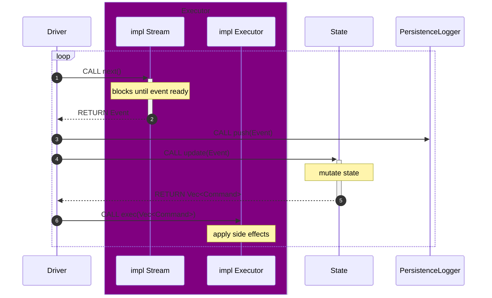

# Monad BFT

![Nightly Tests][tests-badge]

## Overview

This repository contains implementation for the Monad consensus client and JsonRpc server. Monad consensus collects transactions and produces blocks which are written to a ledger filestream. These blocks are consumed by Monad execution, which then updates the state of the blockchain. There are two main database involved, the [blockdb](monad-blockdb/README.md) and [triedb](monad-triedb/README.md), which stores block information and the blockchain state respectively.

## Getting Started

To run a Monad consensus client, follow instructions [here](monad-node/README.md).

To run a JsonRpc server, follow instructions [here](monad-rpc/README.md).

## Architecture

[tests-badge]: https://github.com/monad-crypto/monad-bft/actions/workflows/randomized.yml/badge.svg?branch=master
