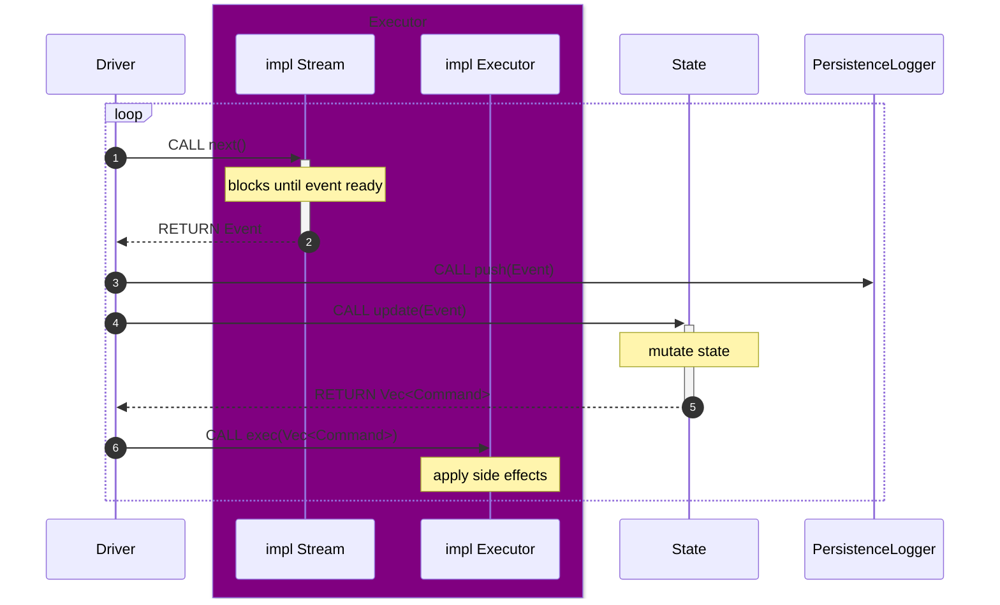

![Nightly Tests][tests-badge]

```mermaid
sequenceDiagram
autonumber
    participant D as Driver
    box Purple Executor
    participant S as impl Stream
    participant E as impl Executor
    end
    participant State
    participant PersistenceLogger
    loop
    D ->>+ S: CALL next()
    Note over S: blocks until event ready
    S -->>- D: RETURN Event
    D ->> PersistenceLogger: CALL push(Event)
    D ->>+ State: CALL update(Event)
    Note over State: mutate state
    State -->>- D: RETURN Vec<Command>
    D ->> E: CALL exec(Vec<Command>)
    Note over E: apply side effects
    end
```

[tests-badge]: https://github.com/monad-crypto/monad-bft/actions/workflows/randomized.yml/badge.svg?branch=master
