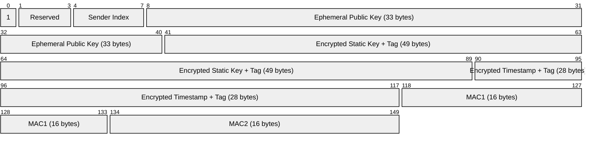
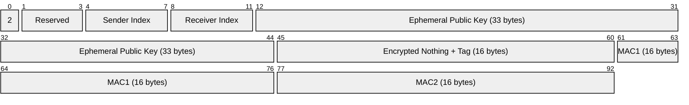
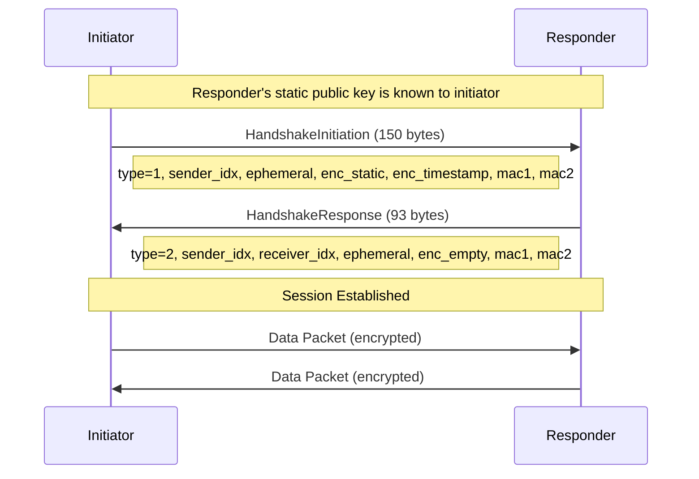
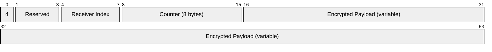
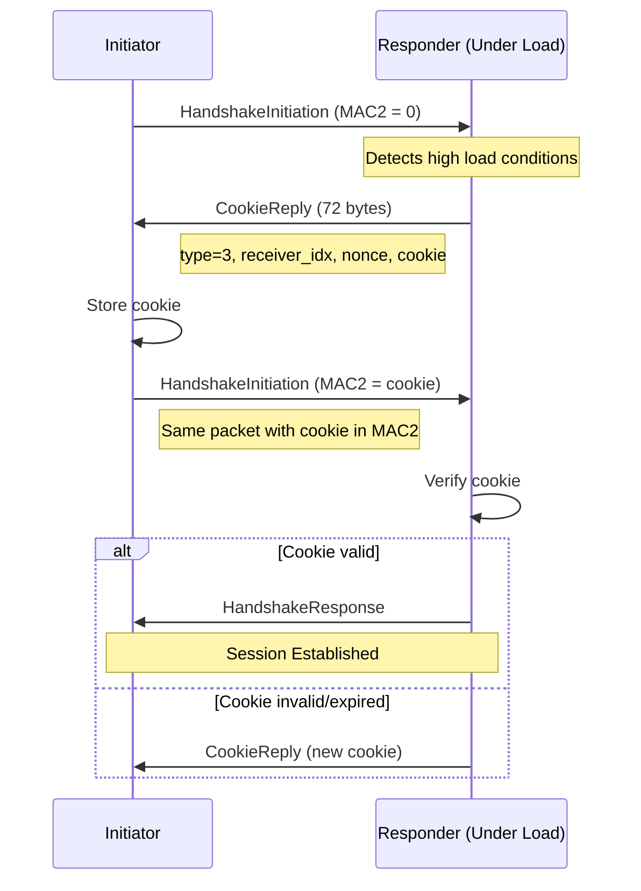
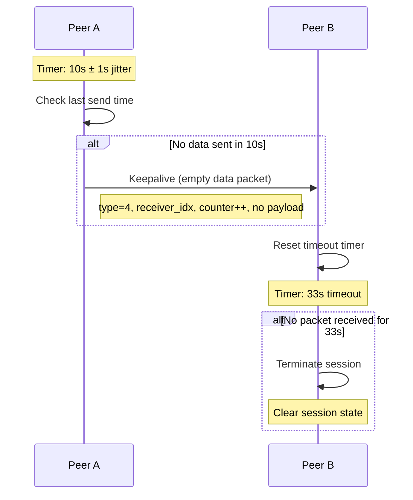
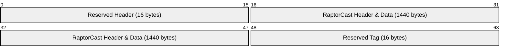

# Authenticated P2P Protocol for UDP

## Table of Contents

- [Introduction](#introduction)
- [Protocol](#protocol)
  - [Cryptography](#cryptography)
  - [Message Types and Flows](#message-types-and-flows)
  - [Cookies](#cookies)
- [Session Management](#session-management)
  - [Sessions](#sessions)
  - [Keepalive](#keepalive)
  - [Rekeying](#rekeying)
- [Integration](#integration)
  - [RaptorCast Integration](#raptorcast-integration)
  - [Discovery Integration](#discovery-integration)
  - [Upgrade Process](#upgrade-process)

## Introduction

This specification defines an authenticated peer-to-peer protocol for UDP-based communication. The protocol addresses two primary concerns in the existing implementation.

The first concern is denial-of-service protection for RaptorCast communication. Current implementations require ECDSA signature verification for each packet, incurring approximately 20-30 microseconds of computational overhead per datagram. This creates a vulnerability where malicious actors can overwhelm validators with invalid signatures. By establishing authenticated sessions using symmetric encryption, the protocol reduces per-datagram overhead to approximately 200 nanoseconds.

The second concern is traffic prioritization for transaction forwarding. The authentication flow guarantees that peers own their claimed IP addresses, enabling efficient prioritization based on either public key identity for known validators or IP address for general traffic. This allows network clients to implement quality-of-service policies that also prevent spam without computatonal overhead.

## Protocol

### Cryptography

The protocol follows the WireGuard design<sup>[4](#ref-4)</sup> with several modifications to cryptographic primitives. These changes enable integration with existing validator keys and achieve performance improvements.

The protocol uses secp256k1, allowing validators to use their existing validator keys as static keys in the Noise protocol. This eliminates the need for separate identity management since validators authenticate using the same keys they use for consensus participation.

AEGIS128L was selected based on performance measurements showing at least a 5x improvement over AES-GCM (approximately 200 nanoseconds versus 1 microsecond per packet) on processors with AES-NI extensions<sup>[5](#ref-5)</sup>.

The choice between BLAKE3 and SHA256 is less critical for protocol performance. BLAKE3 was selected for consistency since it is already used in other parts of the client. Key derivation uses HMAC-based key derivation with BLAKE3 as the underlying hash function.

The Noise Protocol Framework<sup>[2](#ref-2)</sup> provides the handshake structure using the IK pattern with pre-shared key support. This pattern assumes the initiator knows the responder's static public key. The complete construction string is:

```
Noise_IKpsk2_secp256k1_AEGIS128L_BLAKE3
```

### Message Types and Flows

The protocol defines four message types for session establishment and data transfer:

```
TYPE_HANDSHAKE_INITIATION = 1
TYPE_HANDSHAKE_RESPONSE   = 2
TYPE_COOKIE_REPLY         = 3  
TYPE_DATA                 = 4
```

Handshake initiation packets contain 150 bytes:



Field descriptions:
- Type: Message type identifier (1 for initiation) used to distinguish packet types
- Reserved: Padding for alignment and future protocol extensions
- Sender Index: Random 4-byte identifier for this session used in response packets
- Ephemeral Public Key: Per-session ephemeral identity
- Encrypted Static Key: Encrypted initiator's long-term identity
- Encrypted Timestamp: TAI64N timestamp to prevent replay attacks across sessions
- MAC1: Authentication of entire packet using responder's public key hash
- MAC2: Cookie response MAC, empty unless under load (DoS protection)

Handshake response packets contain 93 bytes:



Field descriptions:
- Type: Message type identifier (2 for response) used to distinguish packet types
- Reserved: Padding for alignment and future protocol extensions
- Sender Index: Random 4-byte identifier for responder's session endpoint
- Receiver Index: Echo of initiator's sender index used to correlate response
- Ephemeral Public Key: Per-session ephemeral identity 
- Encrypted Nothing: Empty payload proves responder can derive shared secrets
- MAC1: Authentication of entire packet using initiator's static key hash
- MAC2: Cookie response MAC, empty unless under load (DoS protection)

Session establishment follows the Noise IK handshake pattern:



#### First Message: Initiator to Responder

The initiator creates a handshake initiation message:

```rust
const CONSTRUCTION: &[u8] = b"Noise_IKpsk2_secp256k1_AEGIS128L_BLAKE3";
const IDENTIFIER: &[u8] = b"authenticated udp v1 -- monad";
const LABEL_MAC1: &[u8] = b"mac1----";
const LABEL_COOKIE: &[u8] = b"cookie--";

initiator.chaining_key = hash(CONSTRUCTION);
initiator.hash = hash(&[
    &hash(&[&initiator.chaining_key, IDENTIFIER].concat()),
    &responder.static_public
].concat());

initiator.ephemeral_private = generate_private_key();

msg.message_type = 1;
msg.reserved_zero = [0, 0, 0];
msg.sender_index = rand::random::<u32>();

msg.unencrypted_ephemeral = derive_public_key(&initiator.ephemeral_private);
initiator.hash = hash(&[&initiator.hash, &msg.unencrypted_ephemeral].concat());

let temp = hmac(&initiator.chaining_key, &msg.unencrypted_ephemeral);
initiator.chaining_key = hmac(&temp, &[0x1]);

let temp = hmac(&initiator.chaining_key, &ecdh(&initiator.ephemeral_private, &responder.static_public));
initiator.chaining_key = hmac(&temp, &[0x1]);
let key = hmac(&temp, &[&initiator.chaining_key, &[0x2]].concat());

msg.encrypted_static = aead_encrypt(&key, 0, &initiator.static_public, &initiator.hash);
initiator.hash = hash(&[&initiator.hash, &msg.encrypted_static].concat());

let temp = hmac(&initiator.chaining_key, &ecdh(&initiator.static_private, &responder.static_public));
initiator.chaining_key = hmac(&temp, &[0x1]);
let key = hmac(&temp, &[&initiator.chaining_key, &[0x2]].concat());

msg.encrypted_timestamp = aead_encrypt(&key, 0, &tai64n(), &initiator.hash);
initiator.hash = hash(&[&initiator.hash, &msg.encrypted_timestamp].concat());

let mac_key = hash(&[LABEL_MAC1, &responder.static_public].concat());
msg.mac1 = mac(&mac_key, &msg.as_bytes()[..118]);
msg.mac2 = [0u8; 16];
```

#### Second Message: Responder to Initiator

The responder processes the initiation and creates a response:

```rust
responder.ephemeral_private = generate_private_key();

resp.message_type = 2;
resp.reserved_zero = [0, 0, 0];
resp.sender_index = rand::random::<u32>();
resp.receiver_index = sender_index;

resp.unencrypted_ephemeral = derive_public_key(&responder.ephemeral_private);
responder.hash = hash(&[&responder.hash, &resp.unencrypted_ephemeral].concat());

let temp = hmac(&responder.chaining_key, &resp.unencrypted_ephemeral);
responder.chaining_key = hmac(&temp, &[0x1]);

let temp = hmac(&responder.chaining_key, &ecdh(&responder.ephemeral_private, unencrypted_ephemeral));
responder.chaining_key = hmac(&temp, &[0x1]);

let temp = hmac(&responder.chaining_key, &ecdh(&responder.ephemeral_private, &initiator_static));
responder.chaining_key = hmac(&temp, &[0x1]);

let temp = hmac(&responder.chaining_key, &preshared_key);
responder.chaining_key = hmac(&temp, &[0x1]);
let temp2 = hmac(&temp, &[&responder.chaining_key, &[0x2]].concat());
let key = hmac(&temp, &[&temp2, &[0x3]].concat());
responder.hash = hash(&[&responder.hash, &temp2].concat());

resp.encrypted_nothing = aead_encrypt(&key, 0, &[], &responder.hash);
responder.hash = hash(&[&responder.hash, &resp.encrypted_nothing].concat());

let mac_key = hash(&[LABEL_MAC1, &initiator_static].concat());
resp.mac1 = mac(&mac_key, &resp.as_bytes()[..61]);
resp.mac2 = [0u8; 16];
```

#### Transport Data Keys

After successful handshake, both parties have derived transport keys. The initiator's send_key equals the responder's recv_key, and vice versa, enabling bidirectional encrypted communication.

Data packets use a 16-byte header containing the message type, receiver index, and nonce counter, followed by the encrypted payload and 16-byte authentication tag:



Field descriptions:
- Type: Message type identifier (4 for data) used to distinguish from handshake packets
- Reserved: Padding for alignment and future protocol extensions
- Receiver Index: Session identifier from handshake that routes packet to correct session
- Counter: 64-bit nonce for AEAD encryption that prevents replay within session
- Encrypted Payload: Application data encrypted with session keys

After the handshake completes, both parties derive transport keys:

```rust
let temp = hmac(&chaining_key, &[]);
let temp2 = hmac(&temp, &[0x1]);
let send_key = hmac(&temp, &[&temp2, &[0x2]].concat());
let recv_key = hmac(&temp, &[&temp2, &[0x3]].concat());
```

The initiator and responder derive keys in opposite order, ensuring proper bidirectional communication.

To send encrypted data:

```rust
let mut packet = DataPacket::new();
packet.message_type = 4;
packet.reserved_zero = [0, 0, 0];
packet.receiver_index = peer.receiver_index;
packet.counter = sender.counter;
sender.counter += 1;

let encrypted_data = aead_encrypt(&sender.send_key, packet.counter, &plaintext_data, &[]);
packet.encrypted_data = encrypted_data;
```

Nonces must never be reused. On the receiver side, replay protection should be implemented to account for possible packet reordering within a limited window. WireGuard sets this window to 2000 messages, requiring around 250 bytes per session using a bitmap. We can follow this approach and adjust if there is evidence of dropped packets.

### Cookies

The protocol implements a cookie mechanism to protect against denial-of-service attacks during handshake processing. When a node experiences high load, it can require initiators to prove recent interaction before allocating resources for expensive handshake operations.



Under normal operation, the MAC2 field in handshake packets remains zero. When under load, a responder replies with a cookie instead of processing the handshake. The initiator must then include this cookie in the MAC2 field of a retransmitted handshake initiation. This mechanism ensures that attackers cannot overwhelm nodes with spoofed source addresses, as only legitimate initiators who receive the cookie response can complete the handshake.

Cookie replies are triggered when the global handshake request rate exceeds 1,000 requests per second. Known validators receive special treatment with a separate rate limit of 10 requests per second per validator, bypassing the global rate limit. This ensures legitimate validators can establish sessions even during attack scenarios while preventing any single validator from consuming excessive resources.

The cookie construction uses BLAKE3 keyed hashing with a secret that rotates every two minutes, limiting cookie validity while preventing replay attacks across rotation periods. When under load, the responder generates a cookie:

```rust
let cookie_secret = get_or_rotate_cookie_secret();
let cookie = make_cookie(&cookie_secret, &[
    &initiator_ip.octets(),
    &msg.sender_index.to_le_bytes()
].concat());

let mut reply = CookieReply::new();
reply.message_type = 3;
reply.receiver_index = msg.sender_index;
reply.nonce = rand::random::<[u8; 24]>();

let temp_key = hash(&[LABEL_COOKIE, &responder.static_public].concat());
reply.cookie_encrypted = aead_encrypt_cookie(&temp_key, &reply.nonce, &cookie);

let mac1_key = hash(&[LABEL_MAC1, &initiator_static].concat());
reply.mac1 = mac(&mac1_key, &reply.as_bytes()[..60]);
```

When receiving a handshake initiation with MAC2:

```rust
if msg.mac2 != [0u8; 16] {
    let cookie_secret = get_cookie_secret();
    let expected_cookie = make_cookie(&cookie_secret, &[
        &sender_ip.octets(),
        &msg.sender_index.to_le_bytes()
    ].concat());
    
    let temp_key = hash(&[LABEL_COOKIE, &responder.static_public].concat());
    let mac2_input = &[&msg.as_bytes()[..134], &expected_cookie].concat();
    let expected_mac2 = mac(&temp_key, mac2_input);
    
    if msg.mac2 != expected_mac2 {
        return Err("Invalid cookie");
    }
}
```

## Session Management

### Sessions

The protocol supports two distinct session use cases: long-term sessions for known validator identities, which maintain persistent connections through active keepalive and automatic re-establishment after failures.

Short-lived sessions serve connections with full nodes, which may connect transiently for transaction submission or other queries. Full nodes do not send keepalive packets, allowing these sessions to naturally expire after the timeout period. The implementation will provide an API to establish sessions before sending actual traffic to avoid delays.

Each session requires approximately 512B of memory for nonce replay prevention windows and connection state. With this footprint, nodes can support up to 100,000 concurrent sessions.

### Keepalive

Keepalive maintains session liveness through zero-length data packets:



With a 10-second keepalive interval and 1-second random jitter, sessions terminate after 33 seconds without receiving any packet, accounting for network delays and jitter.

### Rekeying

For this protocol, rekeying is not required for security purposes. The primary consideration would be nonce exhaustion, but with a 64-bit counter providing 2^64 unique values, this is effectively unlimited for practical network operation.

At 1 Gbps throughput with 1500-byte packets, the maximum packet rate is approximately 83,000 packets per second (1 Gbps / (1500 bytes × 8 bits/byte)). With a 64-bit nonce space providing approximately 1.8e19 unique values, nonce exhaustion would occur after 2.2e14 seconds, or approximately 7 million years. Even at theoretical 10 Gbps rates with minimal 64-byte packets, exhaustion would take over 30,000 years.

Future protocol versions may implement non-disruptive rekeying mechanisms if security requirements evolve beyond the current model.

## Integration

### RaptorCast integration

RaptorCast integration reserves 32 bytes in each datagram for header and AEAD encryption.



This reservation applies to all upgraded nodes, regardless of whether specific peers support authentication. When communicating with legacy nodes, the sender uses only 1440 bytes of payload in plaintext, ensuring compatibility. When both peers support authentication, the full 1472-byte packet carries encrypted data.

### Discovery Integration

The peer discovery service advertises authentication capability through a new flag<sup>[6](#ref-6)</sup>:

```
AUTHENTICATED_RAPTORCAST = 1 << 2
```

Nodes include this capability in their MonadNameRecord along with the port number for authenticated connections, allowing peers to identify authentication support and connection details before attempting handshakes.

Authenticated traffic uses a separate UDP socket on port 30304 (subject to change), isolating the authentication state machine from legacy traffic. This separation prevents interference between encrypted and unencrypted flows. Nodes advertise this port number in their discovery records to ensure peers can establish authenticated sessions.

### Upgrade Process

RaptorCast leaders determine chunk sizes based on their authentication support. Legacy leaders create 1472-byte chunks transmitted as plaintext by all nodes. Upgraded leaders create 1440-byte chunks with 32-byte reservation, allowing encrypted transmission to capable peers.

The decision flow for each outgoing packet:

```
if peer.has_capability(AUTHENTICATED_RAPTORCAST) AND session_established(peer):
    send_encrypted(data, full_1472_bytes)
else:
    send_plaintext(data, reduced_1440_bytes)
```
Subsequent peers forward traffic through the encrypted port only if it was received on the encrypted port as well. This guarantees that encryption will be enabled gradually, without interrupting normal operations.

---

<a id="ref-1"></a>
1. AEGIS AEAD specification: https://datatracker.ietf.org/doc/draft-irtf-cfrg-aegis-aead/

<a id="ref-2"></a>
2. Noise Protocol Framework: http://www.noiseprotocol.org/

<a id="ref-3"></a>
3. Lightning Network Transport (BOLT #8): https://github.com/lightning/bolts/blob/master/08-transport.md

<a id="ref-4"></a>
4. WireGuard Protocol: https://www.wireguard.com/protocol/

<a id="ref-5"></a>
5. AEGIS Benchmarks: https://github.com/jedisct1/rust-aegis?tab=readme-ov-file#benchmarks

<a id="ref-6"></a>
6. monad-discovery: future proof name record structure: https://github.com/category-labs/monad-bft/pull/2042
