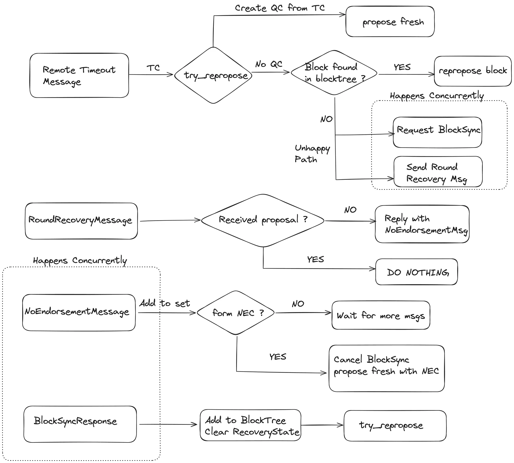

Changes from monad-bft v1
- add proposal_round to Vote
    - and thereby QC
- add proposal_round, ST(proposal.block), Option<NEC> to ProposalMessage
    - ST doesn’t need proposal_round, because it’s only needed for reproposal, and reproposals only are for fresh proposals where proposal_round = block_round
    - leader/pacemaker/etc checks are done against proposal_round
    - if TC doesn’t exist
        - NEC must be None
        - proposal.block.round must be proposal.proposal_round
    - otherwise (TC exists)
        - if QC.block_id = TC.high_tip, then NEC must be None, proposal.block.round = proposal.proposal_round, is fresh proposal
        - otherwise
            - if NEC exists
                - NEC.round = proposal.proposal_round = proposal.block.round
                - NEC.high_qc_round = proposal.qc.round
                - proposal_block can be whatever the leader wants
            - else
                - must be a reproposal
                - TC.high_tip = proposal.block
- tip is (block_header, ST(block_header))
    - need full header because we need the QC
    - QC is needed for validating the tip - make sure it’s a valid proposal
    - to validate
        - check that QC.proposal_round + 1 = tip block round
        - check that signature matches round for tip block round
    - note that TC isn’t needed here because a fresh proposal will ALWAYS have qc.proposal_round + 1 = proposal.block.round
- replace high_qc with high_tip in TimeoutInfo
- TC
    - sequence of high_tip_round
    - includes a single high_tip which corresponds to the highest high_tip_round
- tag the associated vote for high_tip onto TimeoutMessage
    - alternatively, can only tag in the vote signature - the rest is redundant
    - leader should reject any timeouts with vote.block_id ≠ high_tip
- NE/NEC is (round, high_qc.block_round, SCT(round, high_qc.round))
- unhappy unhappy path
    - upon constructing TC, if leader doesn’t have a QC for TC.high_tip, broadcast RequestTip which includes (round, TC). response is either NE or Available.
        - round is TC.round + 1
        - leader blocksyncs upon first available
        - if NEC is constructed at any time (2f+1 threshold), immediately propose and abandon reproposal
        - we need to make sure the round timers get extended in this case? how long should it be extended?
            - extend the timer on first requesttip. never extend more than once

# WIP

Datastructure changes:
- ConsensusBlockHeader.round -> ConsensusBlockHeader.block_round
    - block_round is the round at which the block was *first* proposed
    - even if the block is later reproposed, block_round remains the same
- Vote
    - Add Vote.block_round (round the block/tip was first proposed in)
    - Remove parent_id, parent_round
- Safety
    - Add Safety.maybe_high_tip
        - Only exists if maybe_high_tip.qc.round == high_certificate.qc.round
    - if entered round via TC, only TC matters (qc, tip doesn't matter). TC includes high_tip
    - if entered round via QC, either: we have a high_tip that includes QC, or not
        - we have a high_tip that includes QC
        - no high_tip, but our QC = high_qc
- ProposalMessage
    - Add ProposalMessage.proposal_round
    - Add ProposalMessage.block_header_signature (used in high_tip)
    - Add ProposalMessage.current_round_nec
- TimeoutMessage
    - Rename TimeoutMessage.sig -> TimeoutMessage.timeout_signature
    - Add TimeoutMessage.high_extend
        - Safety.maybe_high_tip if exists, otherwise pacemaker.high_certificate.qc()
    - Add TimeoutMessage.vote_signature
        - Vote for TimeoutMessage.high_extend.tip if it exists
- TimeoutInfo
    - TimeoutInfo.high_qc -> TimeoutInfo.high_tip_round
    - Delete TimeoutDigest
- TimeoutCertificate
    - (epoch, round, vec![high_qc_round, high_tip_round], HighExtend)
    - HighExtend is a tip with round=high_tip_round if max(high_tip_round) > 0
    - Otherwise, is a QC with round=high_qc_round
        - This can happen on genesis (no tip, but everyone times out)
        - Can also happen if a proposal with an invalid tip but valid QC gets proposed
    - if TC.HighExtend is a QC, then the whole no-endorsement stage can be skipped.
- RoundRecoveryMessage
    - (epoch, round, TC)
        - Embeds high_tip, tc
    - Proposer sends this if tc.high_tip isn't coherent at the point in time the proposal starts
    - Proposer should concurrently blocksync if they don't have the associated payload for the tip
- NE/NEC
    - (epoch, round, TC)
        - Embeds highqc_round
    - Only allowed to send NE once per round, and cannot have voted in that round
    - Should be sent if block is not coherent
        - This can happen if execution is delayed, parent block is missing, block is invalid, etc
    - Update high_voted_round upon sending NE
    - NEC is only valid if ProposalMessage.nec.tc matches ProposalMessage.tc
        - this is so that safety can be stateless on the client side - honest validators don't need to make sure that the Request.tip matches TC.tip in a proposal
- Checkpoint
    - add high_certificate
    - add maybe_high_tip (only exists if maybe_high_tip.qc.round == high_certificate.qc.round)
    - remove high_qc
    - if catching up to network via statesync, maybe_high_tip can always be reset to None as high_certificate gets bumped
        - in general, maybe_high_tip should get set to None anytime high_certificate.qc.round exceeds maybe_high_tip.qc.round
    - max(high_tc.round, high_qc.round) + 1 is our current round
    - safety.high_timeout should be initialized to current round
