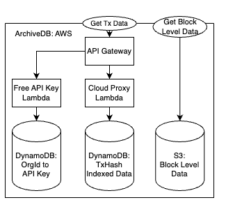

# Monad Archive Developer Docs

Resources:
- Ops references to self-hosted archive (mongo): https://github.com/monad-client-docs/validator-docs/blob/main/docs/full_node/self-hosted-archive/self-hosted-archive.md
- Ops Runbook: https://www.notion.so/Archive-Ops-Runbook-17c75b0ba84080319873ffaac7fdfff1
- Archive Writer Dashboard: https://grafana.devcore4.com/d/dec2qtthsf3lsb/archiving3a-writer-overview?orgId=1&from=now-15m&to=now&timezone=browser&var-net=testnet&refresh=5s

## Goals 

The primary goal of this system is to reliably read blocks, receipts and traces from triedb and write them to a durable 
storage backend before the data rolls off triedb retention. 

A close secondary goal is supporting efficient queries for historical data. This largely falls into 3 categories:
- **Block-level data:** the primary key is block_number or block_hash: block header + body, block receipts, block traces
- **Tx-level data:** the primary key is transaction hash: transactions, receipts, traces
- **Logs:** scoped by any combination of to/from block_number / hash, emitter addresses, topics 0-3. See eth_getLogs

## Features 

**Read from any backend, write to any backend**
- `--block-data-source` allows passing different backend locators: "aws testnet-ltu-032-0 50", "triedb /data/triedb 5000", "mongo ...", etc.
- `--archive-sink` similar to above, but only supports writable backends, aka no triedb

**Read and convert any previous schema version**
- Archive data volume will grow to be huge over time
- Versioned schemas and matching enums allow decoding any previous schema
- Can convert any previous schema to the latest on-the-fly and automatically

**Locally stateless, can be terminated and restarted at any time**

**Safe, no-touch upgrades**
- `--fallback-block-data-source` takes same string format as `--block-data-source`, used when the primary source does not have data. See "When will an archiver will copy data from another bucket B to it's bucket Sink" for more details

**Comprehensive Metrics**
- Enables detailed dashboarding and alerting
- Can determine if any binaries in the system are unhealthy without needing to ssh to each box

## Terms:

- **Archive-Backed RPC**: rpc configured to read from an ArchiveDB
- **Genesis Archive-Backed RPC**: rpc configured to read from an ArchiveDB with history back to genesis
- **Self-hosted Archive:** Same operator runs ArchiveWriter, ArchiveDB and Archive-Backed RPC
- **ArchiveWriter**: variant of Monad Node that writes into ArchiveDB
- **ArchiveDB**: any durable storage system that provides longer history retention than MonadDB (not sure of this definition)
- **State Archive:** an archive that includes historical storage slots (state) not just blocks, receipts and traces

## System Diagrams

## File Structure of Library and Binaries 
The archive system is broken apart into a core library, `monad-archive`, and 4 
scoped binaries:
- `monad-archiver`
- `monad-archive-checker`
- `monad-indexer`
- `monad-index-checker`

Within the library there are 3 primary abstraction tiers, in order from lowest to highest:
- kvstore
    - Defines a key-value store trait and it's read-only equivalent. 
    - Provides implementations for many backends, including `TrieDB`, `S3`, `DynamoDB`, `MongoDB`, `MemoryStorage`
    - Uses enum dispatch to provide a type erased `KVStore`/`KVReader` to prevent generics contagion 
    without needing dynamic dispatch
- model
    - Provides abstractions for reading/writing domain structures on top of any kvstore implementation
    - `block_data_archive.rs` responsible for block, block receipts and block traces (aka block-level data). This is the "primary" archive data,
      all other index data can be derived/recovered from this data. Defines how to archive a single block_number.
    - `tx_index_archive.rs` responsible for tx hash indexed data, such as transactions, transaction receipts and traces. Defines 
      how to index a particular block.
    - `logs_index.rs` responsible for creating an index to efficiently support eth_getLogs queries. Unlike other modules, it does not
       rely on kvstore, but directly works with mongo apis. 
    - The model folder also defines the Binary representations including schema versioning and on-the-fly conversion to the latest schema
- workers
    - All workers are locally stateless, meaing they can be terminated and restarted at any time
    - `block_archive_worker.rs` Manages reading block-level data from a block data source (i.e. Triedb or another archive replica) and writing to an archive-sink (i.e. an archive replica). Uses a source and uploaded latest block pointer to keep track of progress. 
    - `index_worker.rs` Similar to above, this worker reads from the archive replica and writes to same replica's tx index. If the backing kvstore is mongo, then it also using the `LogIndexArchive` to support efficient eth_getLogs queries.
    - `bft_block_archiver.rs` Uploads bft blocks found in the node's local folder to the archive. Compares what is locally on disk to what is in the archive and uploads the delta.
    - `file_checkpointer.rs` Watches a file on disk and periodically uploads a copy

There are several one-off modules at the top-level:
- `archive_reader.rs` Defines a unified tx index and block data reader. Optionally includes a fallback source, aka mongo as primary and aws as fallback, but other configurations work too.
- `cli.rs` Defines custom parser for `--block-data-source`, `--archive-sink`, etc. to enable flexibly connecting sources and sinks of various backend types. Also defines using these fields to construct the appropriate `KVStore`/`KVReader` instances.
- `fault.rs` Will be removed when checker migration is complete.
- `metrics.rs` Defines shared object to record metrics and is responsible for pushlishing otel metrics to configured collector endpoint.
- `prelude.rs` Re-exports commonly used types
- `rlp_offset_scanner.rs` Partially decodes rlp data to find field offsets. Used in Reference storage type by model
- `test_utils.rs` Defines common mock data generation test utilities.

### When will an archiver will copy data from another bucket B to it's bucket Sink
Either:
- B is the Primary source (--block-data-source "aws B" flag)
- B is set as the Fallback (`--fallback-block-data-source "aws B" flag) source AND the following conditions are met
    - Primary source has latest_block > Sink.latest_block. Or concretely, triedb's latest block is greater than the latest block this archiver has archived
    - Primary source does not have block, trace or receipts
    - B (fallback source) does have whichever of block, trace or receipts Primary source is missing
    - Then => archiver will copy the data Primary source does not have from Fallback source B to Sink

To clarify when the above does not apply:
- If Archive (Sink) has latest set to block 100 and Primary source has block 102, but the Archive is missing blocks 90-95
Archive will NOT copy data from Fallback to Sink
- If Archive has latest block 100, Primary has latest block 100 and Fallback has latest block 105
Archive will NOT advance past Primary, aka will not copy data from Fallback to Sink

Unless --start-block is set, which implies a manual intervention, the system will never write data that it's local node has or could have in the future.
The only way the above cases line up is if the local node's triedb (set as Primary source) is missing earlier blocks but does have later blocks, i.e. a hard reset or rolled off retention
